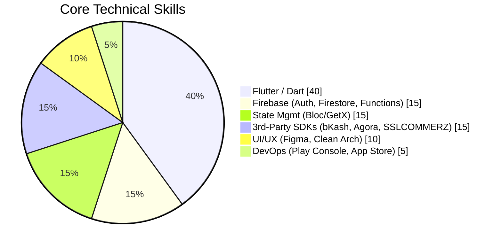
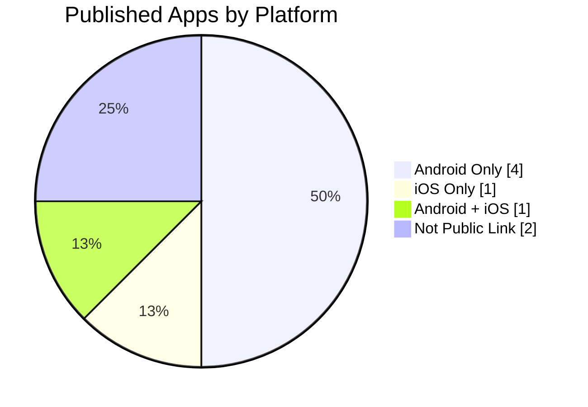

<div align="center">


<br/>


<br/><br/>

[](tel:+8801758691303)
[](mailto:swe.mahmud@gmail.com)
[](#)

</div>

---

## 👨‍💻 About Me

Flutter Mobile Application Developer with **4+ years of experience** building and shipping **8 production apps** on Google Play Store and Apple App Store. Skilled in Flutter, Dart, Bloc/GetX, and Firebase, with hands-on experience integrating third-party SDKs including bKash, SSLCOMMERZ, and Agora.

---

## 💼 Professional Experience

```
2024 ─────────────────────────────────────────────► Present
 │
 ├── Software Engineer (Mobile) — Analyzen Bangladesh Limited
 │   Dec 2024 – Present
 │   Leading cross-platform mobile app development for a software firm,
 │   focusing on scalable solutions and optimal performance.
 │
2022 ──────────────────── 2024
 │
 └── Mobile Application Developer — Limerick Resources Limited
     Apr 2022 – Nov 2024
     Engineered end-to-end mobile applications that automated
     workflows and enhanced service delivery.
```

---

## 📊 GitHub Stats & Activity

<div align="center">


<br/>


<br/>


</div>


## 🧠 Skill Distribution

<div align="center">



</div>

---

## 🛠️ Areas of Expertise

| Category | Skills |
|---|---|
| 📱 **Mobile Development** | Flutter, Dart, GetX, Bloc (State Management) |
| ☁️ **Backend & Cloud** | Firebase (Auth, Firestore, Cloud Functions) |
| 🔌 **Third-Party Integrations** | Agora SDK, Google Maps API, bKash SDK, SSLCOMMERZ, Stripe, Facebook SDK |
| 🎨 **UI/UX & Design** | Figma, Responsive UI, Clean Architecture |
| 🔧 **Version Control & Collaboration** | GitHub, GitLab, Jira, ClickUp |
| 🚀 **Deployment & Distribution** | Google Play Console, App Store Connect |

<div align="center">


</div>

---

## 🚀 Key Projects (Published on Play Store & App Store)

<div align="center">



</div>

| App | Description | Links |
|---|---|---|
| **Creed** | Muslim Commerce Platform & Global Business Directory | [Android](https://play.google.com/store/apps/details?id=app.ourcreed.shop) · [iOS](https://apps.apple.com/us/app/creed-muslim-commerce-platform/id6747739980) |
| **Nafs Cart** | E-commerce shopping app | [iOS](https://apps.apple.com/us/app/nafs-cart-e-commerce/id6756256618) |
| **OrderWala** | Retailer Order Management System | [Android](https://play.google.com/store/apps/details?id=com.order.wala.app) |
| **DSR MDO** | Daily Sales Representative & Market Development | [Android](https://play.google.com/store/apps/details?id=com.limerickbd.dsr_so_app) |
| **Boichitro** | Digital Bookstore & e-Reading App | — |
| **HRM** | Human Resource & Payroll Management | — |
| **Distributor** | Distributor Onboarding & Stock Tracking | [Android](https://play.google.com/store/apps/details?id=com.limerickbd.distributor) |
| **BDDoctor** | Doctor & Hospital Finder with Geo-search | [Android](https://play.google.com/store/apps/details?id=com.bddoctor.bdboctor) |

---

## 🎓 Education

```
🎓  B.Sc. in Software Engineering — Daffodil International University · 2022 · GPA 3.52
🏫  Higher Secondary Certificate (Science) — Jashore Shikkha Board · 2018 · GPA 3.67
🏫  Secondary School Certificate (Science) — Manirampur, Jashore · 2016 · GPA 4.67
```

## 📜 Training & Certifications

- ✅ Mobile Application Development Courses — BASIS-SEIP Project, Kawran Bazar, Dhaka
- ✅ Flutter & Dart – The Complete Guide (Udemy)
- ✅ Flutter BLoC (Udemy)
- ✅ CCNA — American International University Bangladesh

---

<div align="center">

📍 **Mohammadpur, Dhaka, Bangladesh**


</div>
