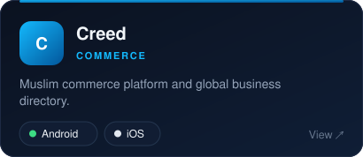
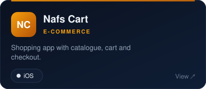
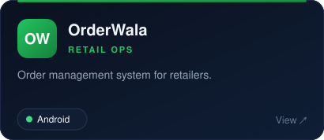
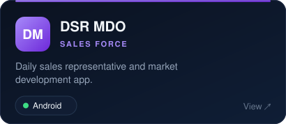
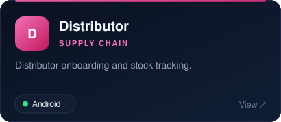
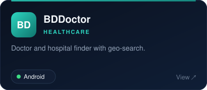
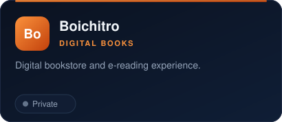
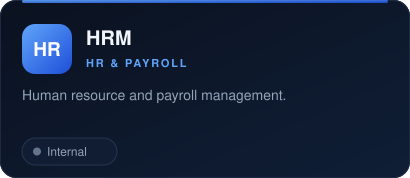
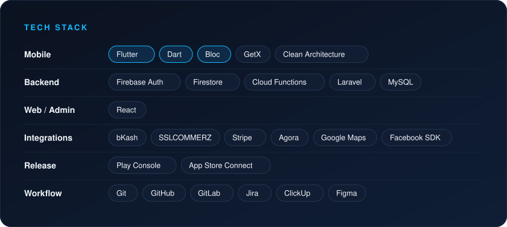

  

  
  

### About

Software Engineer (Mobile) at **Analyzen Bangladesh Limited**. I build Flutter apps end to end, from architecture and state management to payment integrations and store releases, and the Laravel + React admin panels behind them when a product needs one.

  

### Selected Work

  <a href="https://play.google.com/store/apps/details?id=app.ourcreed.shop"></a>
  <a href="https://apps.apple.com/us/app/nafs-cart-e-commerce/id6756256618"></a>
  <a href="https://play.google.com/store/apps/details?id=com.order.wala.app"></a>
  <a href="https://play.google.com/store/apps/details?id=com.limerickbd.dsr_so_app"></a>
  <a href="https://play.google.com/store/apps/details?id=com.limerickbd.distributor"></a>
  <a href="https://play.google.com/store/apps/details?id=com.bddoctor.bdboctor"></a>
  
  

Creed is also on the <a href="https://apps.apple.com/us/app/creed-muslim-commerce-platform/id6747739980">App Store</a>.

  

### Activity

  

### Education & Training

**B.Sc. in Software Engineering** · Daffodil International University · 2022 
Mobile Application Development · BASIS-SEIP 
Flutter & Dart: The Complete Guide · Flutter BLoC · Udemy 
CCNA Training · American International University-Bangladesh

  

